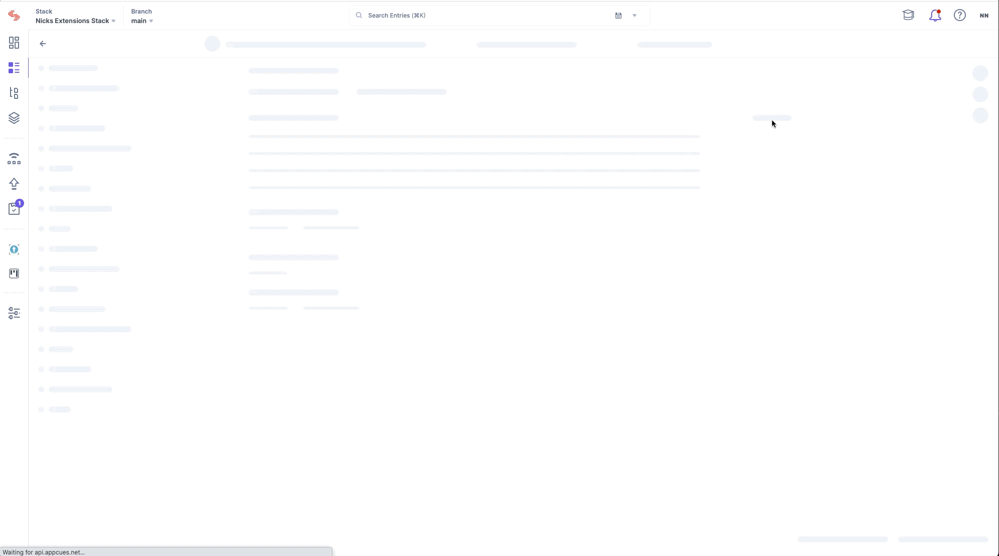
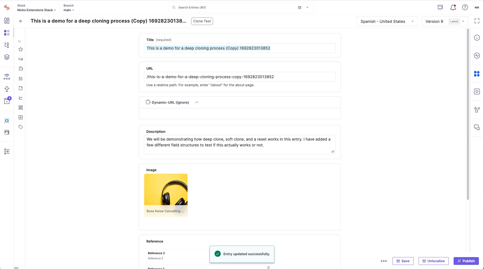

#  Contentstack Marketplace App Boilerplate

  This project assumes you have a project set up in the Developer Hub already.
  - [Marketplace App Boilerplate Documentation](https://www.contentstack.com/docs/developers/developer-hub/marketplace-app-boilerplate/)
- [Marketplace Boiler Plate](https://github.com/contentstack/marketplace-app-boilerplate)

**Disclaimer**: The code provided herein is intended solely for demonstration and proof-of-concept purposes. It is NOT intended for production use, nor should it be used in any environment or application where its failure or misbehavior could lead to direct or indirect harm, loss, or damage.

Users are strongly advised to thoroughly review, test, and, if necessary, modify the code before considering its use in any real-world or production scenario.

By using or implementing this code, you acknowledge and accept all risks associated with its use and agree to hold harmless the author(s) or provider(s) from any and all claims, damages, or liabilities.

# App List

##  Check Parent References 

#### Description
The check parent references sidebar widget that will show you all content that is associated with it. It will display how many levels of depth above the parent references are as well.

#### Location
This app is based on the [sidebar location](https://github.com/nicknguyen-cs/sample-apps/blob/main/src/containers/SidebarReferencesWidget/EntrySidebar.tsx)

#### Demo

#### Install & Use Instructions

 - Install the app via Developer Hub and host it locally or with a provider
 - API Key and Management Token are needed to access the functionality and the app requires the config variables.
 - Open an entry, and locate the widgets section. Find what you named the app location and it should populate a list of all connected content.

## Reset Localization

Users can go to the sidebar and click a button that will reset an entry back to an empty slate. Easy to start a new localization from scratch. Users will need to refresh the page to see the empty updated entry.

#### Demo

## Dynamic URL

This custom field will take the current locale and pre-pend it to a current url field. So if you're current URL field is "/category/jacket" it will convert it to "/{locale}/category/jacket". The logic can be fine tuned to match your folder structure if needed. 

#### Demo

## RTE Embed with Metadata

Details coming soon...

## Custom Select Option from an API Response

Details coming soon...

## Shallow Clone an Entry

Details coming soon...

## Deep Clone an Entry

Details coming soon...
