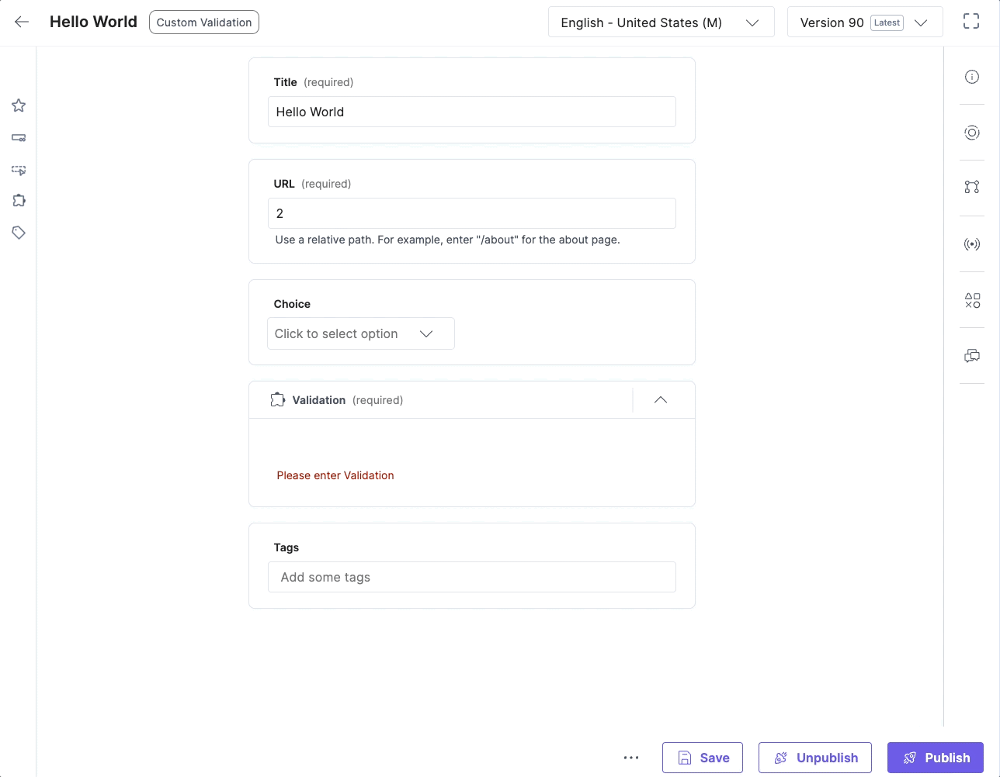

#  Contentstack Marketplace App Boilerplate

  This project assumes you have a project set up in the Developer Hub already.
  - [Marketplace App Boilerplate Documentation](https://www.contentstack.com/docs/developers/developer-hub/marketplace-app-boilerplate/)
- [Marketplace Boiler Plate](https://github.com/contentstack/marketplace-app-boilerplate)

**Disclaimer**: The code provided herein is intended solely for demonstration and proof-of-concept purposes. It is NOT intended for production use, nor should it be used in any environment or application where its failure or misbehavior could lead to direct or indirect harm, loss, or damage.

Users are strongly advised to thoroughly review, test, and, if necessary, modify the code before considering its use in any real-world or production scenario.

By using or implementing this code, you acknowledge and accept all risks associated with its use and agree to hold harmless the author(s) or provider(s) from any and all claims, damages, or liabilities.

# App List

## Entry Clone Sidebar Widget

### Overview
This Sidebar Widget efficiently clones an existing entry and all its references, ensuring the newly created entries are interconnected and refer to the new cloned data. It simplifies the process of duplicating complex entries while maintaining data integrity and consistency. Note: This widget does not clone assets.

### Features
- **Clone Entry and References**: Quickly duplicates any entry along with its references.
- **Relink Cloned Data**: Automatically updates links in the cloned data to point to the new entries.
- **User-Friendly Interface**: Easy to use sidebar widget integrated into your CMS.
- **Locale Cloning**: A checkbox for deep cloning with localized languages as well.

### Demo
Coming soon...

### Location
This app is based on the [sidebar location](https://github.com/nicknguyen-cs/sample-apps/tree/main/src/containers/SideBarDeepClone)

### Usage
1. Open the CMS and navigate to the entry you want to clone.
2. Click on the Sidebar Widget in the entry screen.
3. Select the "Clone Entry" button to open the modal.
4. Select if you would like to clone all locales as well, and click clone
5. A table with every cloned entry and localization will show during process.

## Check References Sidebar Widget

### Overview
The Check References Sidebar Widget is  designed for users who need to understand the relational structure of their content. This widget, accessible from the sidebar, displays all entries that are associated with the selected entry. It also indicates the depth levels of parent references, providing a clear view of how content is interconnected within your CMS.

### Features
- **Display Associated Entries**: Easily view all entries related to the selected one.
- **Depth Level Indication**: Shows how many levels of depth the parent references have, offering insights into the content hierarchy.
- **Sidebar Integration**: Conveniently located in the CMS sidebar for quick access.
- **Enhanced Content Management**: Ideal for managing complex content structures and understanding content relationships.

### Demo

### Usage
1. Open the CMS and navigate to an entry
2. Open the Sidebar and there should be a data list present for you to overview

### Location
This app is based on the [sidebar location](https://github.com/nicknguyen-cs/sample-apps/blob/main/src/containers/SidebarReferencesWidget/EntrySidebar.tsx)

### Install & Use Instructions
 - Install the app via Developer Hub and host it locally or with a provider
 - API Key and Management Token are needed to access the functionality and the app requires the config variables.
 - Open an entry, and locate the widgets section. Find what you named the app location and it should populate a list of all connected content.

## Reset Entry Localization Sidebar Widget

### Overview

This app allows users to reset any entry back to an empty slate, ideal for starting new localizations from scratch. The app is based on the sidebar location and integrates a simple button that performs this reset action. Please note, after using the reset feature, users will need to refresh the page to see the updated empty entry.

### Features
- **Easy Entry Reset**: One-click functionality to reset any CMS entry to its initial, empty state.
- **Sidebar Integration**: Seamlessly integrated into the CMS sidebar for easy access.
- **Ideal for Localization**: Perfect for starting new localizations or translations from scratch.

### Demo

### Usage
1. Navigate to the entry locale you want to reset.
2. In the sidebar, locate and click the "Reset Entry" button.
3. Confirm the action if prompted.
4. Refresh the page to view the entry reset to an empty state.

### Location
This app is based on the [sidebar location](https://github.com/nicknguyen-cs/sample-apps/tree/main/src/containers/SideBarResetEntry)

## Dynamic URL for Entry Custom Field

### Overview
It will take the current locale and pre-pend it to a current url field. So if you're current URL field is "/category/jacket" it will convert it to "/{locale}/category/jacket". The logic can be fine tuned to match your folder structure if needed. 

### Features
- **Automatic URL creation**: User's don't have to worry about generating locale specific content
- **Error Prevention**: This works after save, so it always looks the same, even if a user mistakenly changes the URL.

#### Demo

### Usage
1. This will be a custom field that is read-only, no interaction needed by a user.

### Location
This custom field is based on the [custom field location](https://github.com/nicknguyen-cs/sample-apps/tree/main/src/containers/CustomFieldDynamicUrl)

## Custom Field Validation

### Overview
This uses a custom field with the required attribute. It checks other values in the entry and if they exist it fills the custom field with a valid message. Once saved and the validation passes, users can then publish an entry. 

### Features
- **Validation**: Custom validation to get around the current foundation of Contentstack
npn
#### Demo

### Usage
1. This will be a custom field that is read-only, no interaction needed by a user.

### Location
This custom field is based on the [custom field location](https://github.com/nicknguyen-cs/sample-apps/tree/main/src/containers/CustomFieldValidation)

